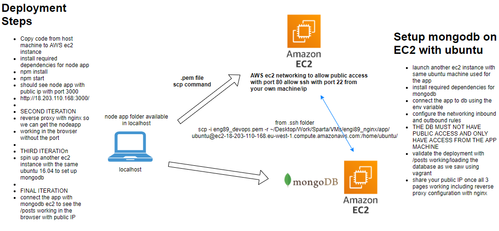
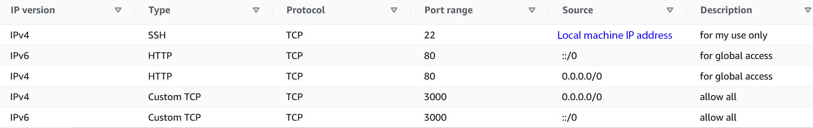
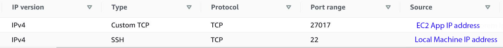

# 2 Tier App Deployment


### Set up Security Groups AWS
App

db


### App VM
- Secure copy of app folder from local machine to EC2 (virtual) server
`scp -i [.pem file path] -r [app folder on localhost] [ec2 instance name]:[desired dir]`
for exaple:
`scp -i "eng89_devops.pem" -r "C:\Users\Projects\eng89\app" ubuntu@ec2-1.1.1.1.eu-west-1.compute.amazonaws.com:app/`

- ssh to app
```
# upgrade and update
sudo apt-get update -y
sudo apt-get upgrade -y

# install dependencies
sudo apt-get install nginx -y
sudo apt-get systemctl restart nginx
curl -sL https://deb.nodesource.com/setup_6.x | sudo -E bash -
sudo apt-get install -y nodejs 
sudo apt-get install -y npm
sudo apt-get install python-software-properties -y
sudo npm install -g pm2
cd app/
sudo npm install -y
```
- Create an environment variable to connect to db (from main directory)
```python
sudo echo "export DB_HOST=mongodb://1.1.1.1:27017/posts" >> ~/.bashrc
source ~/.bashrc
# check
printenv DB_HOST
```
### DB VM
- ssh to db
```python
# update the mongodb package so it can be upgraded
sudo apt-key adv --keyserver hkp://keyserver.ubuntu.com:80 --recv D68FA50FEA312927
echo "deb https://repo.mongodb.org/apt/ubuntu xenial/mongodb-org/3.2 multiverse" | sudo tee /etc/apt/sources.list.d/mongodb-org-3.2.list

# update and upgrade
sudo apt-get update -y
sudo apt-get upgrade -y

# install dependencies
sudo apt-get install mongodb-org=3.2.20 -y
sudo apt-get install -y mongodb-org=3.2.20 mongodb-org-server=3.2.20 mongodb-org-shell=3.2.20 mongodb-org-mongos=3.2.20 mongodb-org-tools=3.2.20

# navigate and amend mongo configurations
cd /etc
sudo nano mongod.conf
# network interfaces
net:
	port: 27017
	bindIp: 0.0.0.0

```
